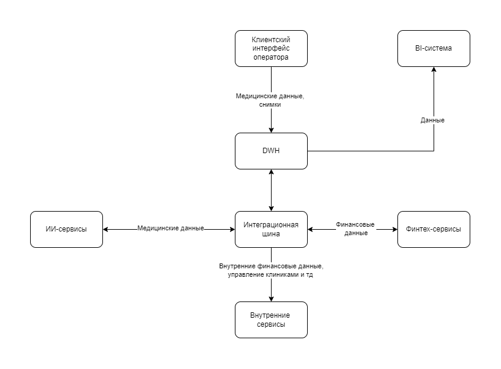

# Целевая архитектура системы через год

## Оглавление

- [Целевая архитектура системы через год](#%D1%86%D0%B5%D0%BB%D0%B5%D0%B2%D0%B0%D1%8F-%D0%B0%D1%80%D1%85%D0%B8%D1%82%D0%B5%D0%BA%D1%82%D1%83%D1%80%D0%B0-%D1%81%D0%B8%D1%81%D1%82%D0%B5%D0%BC%D1%8B-%D1%87%D0%B5%D1%80%D0%B5%D0%B7-%D0%B3%D0%BE%D0%B4)
  - [Оглавление](#%D0%BE%D0%B3%D0%BB%D0%B0%D0%B2%D0%BB%D0%B5%D0%BD%D0%B8%D0%B5)
  - [Что было до трансформации](#%D1%87%D1%82%D0%BE-%D0%B1%D1%8B%D0%BB%D0%BE-%D0%B4%D0%BE-%D1%82%D1%80%D0%B0%D0%BD%D1%81%D1%84%D0%BE%D1%80%D0%BC%D0%B0%D1%86%D0%B8%D0%B8)
  - [Что стало после трансформации](#%D1%87%D1%82%D0%BE-%D1%81%D1%82%D0%B0%D0%BB%D0%BE-%D0%BF%D0%BE%D1%81%D0%BB%D0%B5-%D1%82%D1%80%D0%B0%D0%BD%D1%81%D1%84%D0%BE%D1%80%D0%BC%D0%B0%D1%86%D0%B8%D0%B8-%D1%87%D0%B5%D1%80%D0%B5%D0%B7-%D0%B3%D0%BE%D0%B4)
  - [Сравнительная таблица](#%D1%81%D1%80%D0%B0%D0%B2%D0%BD%D0%B8%D1%82%D0%B5%D0%BB%D1%8C%D0%BD%D0%B0%D1%8F-%D1%82%D0%B0%D0%B1%D0%BB%D0%B8%D1%86%D0%B0)
  - [Приоритизация шагов по переходу к новой архитектуре](#%D0%BF%D1%80%D0%B8%D0%BE%D1%80%D0%B8%D1%82%D0%B8%D0%B7%D0%B0%D1%86%D0%B8%D1%8F-%D1%88%D0%B0%D0%B3%D0%BE%D0%B2-%D0%BF%D0%BE-%D0%BF%D0%B5%D1%80%D0%B5%D1%85%D0%BE%D0%B4%D1%83-%D0%BA-%D0%BD%D0%BE%D0%B2%D0%BE%D0%B9-%D0%B0%D1%80%D1%85%D0%B8%D1%82%D0%B5%D0%BA%D1%82%D1%83%D1%80%D0%B5)
    - [Принципы приоритизации:](#%D0%BF%D1%80%D0%B8%D0%BD%D1%86%D0%B8%D0%BF%D1%8B-%D0%BF%D1%80%D0%B8%D0%BE%D1%80%D0%B8%D1%82%D0%B8%D0%B7%D0%B0%D1%86%D0%B8%D0%B8)
  - [Результаты](#%D1%80%D0%B5%D0%B7%D1%83%D0%BB%D1%8C%D1%82%D0%B0%D1%82%D1%8B)

## Что было до трансформации

1. **Один монолитный DWH** (MS SQL Server 2008) содержал всё:

   - Источник, логика, агрегаты, отчёты.
   - Бизнес-правила реализованы в SQL, вьюхах и хранимках.
   - Использовался как центральная точка интеграции для всех направлений.

1. **Клиентский интерфейс операторов на PowerBuilder** — устаревший интерфейс.

   - Подключался напрямую к DWH.
   - Содержал логику отображения и бизнес-логику.

1. **BI-система (Power BI)** — подключен прямо к DWH.

   - Построение отчётов вручную.
   - Низкая производительность, долгие выборки.
   - Долгое время ожидания при построении сложных срезов.

1. **Интеграции через Apache Camel** — централизованная шина.

   - Синхронная маршрутизация, сильная связонность компонентов системы.
   - Нет возможности хранения сообщений внутри шины.
   - Возможна потеря сообщений.
   - Надо менять маршруты при добавлении новых участников маршрутизации.

1. **Финтех-сервисы, ИИ-сервисы, внутренние системы**:

   - Обменивались данными только через шину и DWH.
   - Финтех на Go/Java, ИИ — на Python.
   - Отдельной ответственности за домены не было.

1. **Отсутствие доменной структуры**:

   - Все направления работали через общий DWH.
   - Любые изменения или новые сервисы требовали доработок в централизованной базе и шине.

## Что стало после трансформации

1. **Разделение на домены**:

   - Появились микросервисы: Fintech, Clinic, AI, HR, Inventory.
   - Каждый сервис управляет своими данными и логикой.

1. **Data Portal**:

   - Современный интерфейс, где пользователь сам строит отчёты.
   - Работает через API Gateway и проверяет доступы через Auth Service.

1. **Data Mart**:

   - Подготовленные, агрегированные срезы данных.
   - Используется BI и порталом.
   - Разгружает основной DWH.

1. **ETL-платформа (Airflow)**:

   - Извлекает данные из сервисов и DWH.
   - Делает трансформации и загружает в Data Mart.
   - Логика вынесена из SQL в управляемые пайплайны.

1. **Authorization Service (RBAC + OAuth2)**:

   - Управляет доступом к данным в зависимости от ролей.

1. **Обновлённые BI-инструменты**:

   - Подключены к Data Mart, а не к DWH.
   - Быстрее, устойчивее, гибче.

1. **Legacy DWH остаётся**:

   - Только как источник исторических данных.
   - Новая логика и отчёты на нём не строятся.

## Сравнительная таблица

| Было                                                   | Стало                                              |
| ------------------------------------------------------ | -------------------------------------------------- |
| Централизация логики и аналитики в одном DWH           | Распределённая архитектура по доменам              |
| PowerBuilder — старый интерфейс, лезет прямо в базу    | Портал самообслуживания — современный UI через API |
| Нет разграничения доступа                              | OAuth2 + RBAC                                      |
| Вся бизнес-логика в SQL, вьюхах, хранимках             | Бизнес-логика — в сервисах и ETL                   |
| BI-инструменты работают прямо с DWH                    | BI и портал работают с Data Mart                   |
| Apache Camel — централизованная шина                   | API и самостоятельные домены                       |
| Трудно масштабировать системы, добавлять новые бизнесы | Независимое развитие доменов                       |
| Сложно менять, низкий time-to-market                   | Гибкая, расширяемая архитектура                    |
| Медленные отчёты                                       | Быстрая аналитика через витрины                    |

## Приоритизация шагов по переходу к новой архитектуре

Переход от централизованной архитектуры (DWH + PowerBuilder) к распределённой (Data Mart + Domain Services) требует пошагового подхода. Ниже представлены этапы, отсортированные по степени влияния на устойчивость, выгоду для бизнеса и готовность к внедрению.

| №   | Шаг                                          | Цель                                  | Описание                                                                      | Приоритет (MoSCoW) |
| --- | -------------------------------------------- | ------------------------------------- | ----------------------------------------------------------------------------- | ------------------ |
| 1   | Вынести бизнес-логику из DWH в ETL           | Убрать зависимость от хранимок и вьюх | Перенос расчётов в Airflow. Возможность тестирования и версионирования.       | Must               |
| 2   | Настроить Data Mart                          | Ускорить доступ к аналитике           | Создание витрин по ключевым метрикам. Подключение BI и портала.               | Must               |
| 3   | Разделить систему на домены                  | Независимая эволюция направлений      | Выделение Fintech, Clinic, HR и других в отдельные сервисы с собственной БД.  | Must               |
| 4   | Развернуть портал                            | Снизить нагрузку на BI и DWH          | Веб-интерфейс, через который пользователи сами строят отчёты.                 | Should             |
| 5   | Внедрить Auth Service (OAuth2 + RBAC)        | Защита данных                         | Контроль доступа к данным через роли. Подключение к порталу и BI.             | Should             |
| 6   | Перенести BI-инструменты на Data Mart        | Повысить производительность           | BI должен читать данные только из витрины, а не из сырого DWH.                | Should             |
| 7   | Начать миграцию данных из DWH в домены       | Удаление дублирующих источников       | Постепенная передача хранения и ответственности за данные в доменные сервисы. | Should             |
| 8   | Внедрить Data Governance                     | Управление качеством данных           | Lineage, владельцы, документация моделей и витрин.                            | Should             |
| 9   | Реализовать стриминговую архитектуру (Kafka) | Подготовка к real-time аналитике      | Добавление real-time потока событий и алертов.                                | Could              |
| 10  | Полный отказ от PowerBuilder                 | Завершение ухода от устаревшего UI    | Требует подготовки процессов и переноса логики в новый интерфейс.             | Won’t              |
| 11  | Полная миграция DWH на первом этапе          | Снижение зависимости от DWH           | Риски высоки, переход будет постепенным.                                      | Won’t              |
| 12  | Реализация полной real-time аналитики в MVP  | Быстрая реакция на данные             | Для MVP не требуется, будет внедрено позже.                                   | Won’t              |

### Принципы приоритизации

- **Must** — критично для начала трансформации и получения бизнес-ценности.
- **Should** — желательно реализовать как можно скорее, но не блокирует запуск.
- **Could** — nice-to-have, можно реализовать позже.
- **Won’t** — осознанно исключено из ближайших этапов, может быть выполнено в будущем.

## Результаты

- Аналитика работает быстрее.
- Бизнес-пользователи могут работать с данными напрямую.
- Архитектура стала модульной, масштабируемой.
- Повышена безопасность доступа к данным.
